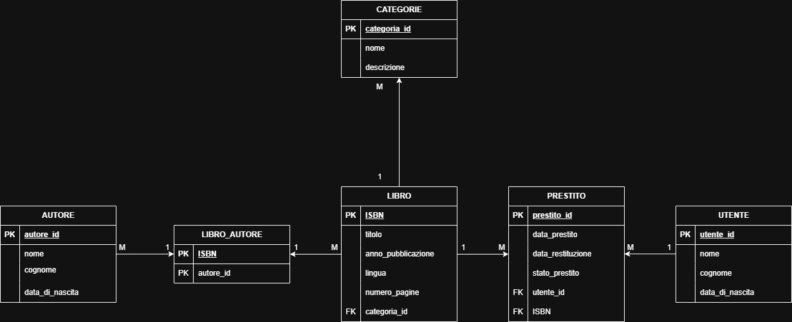
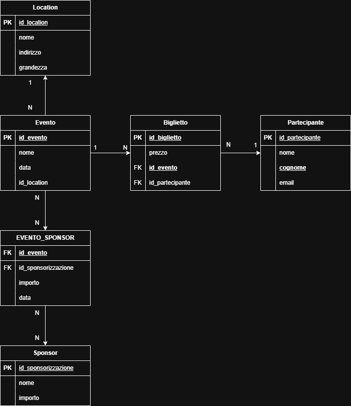
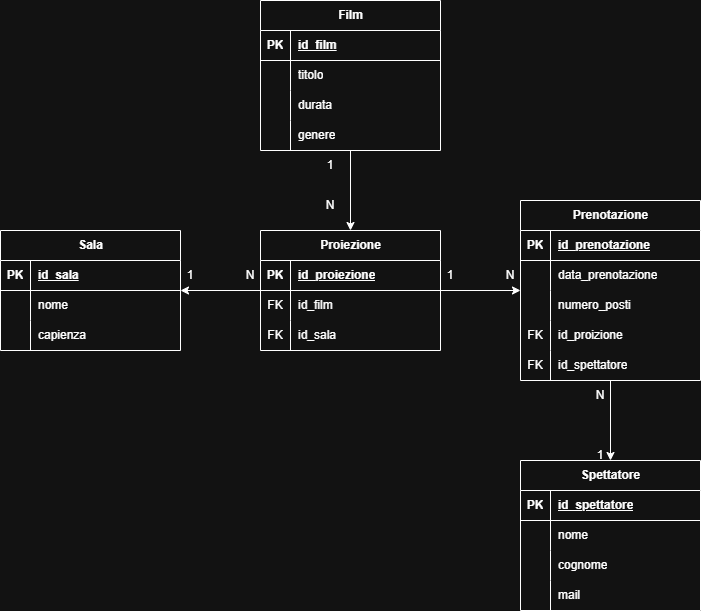
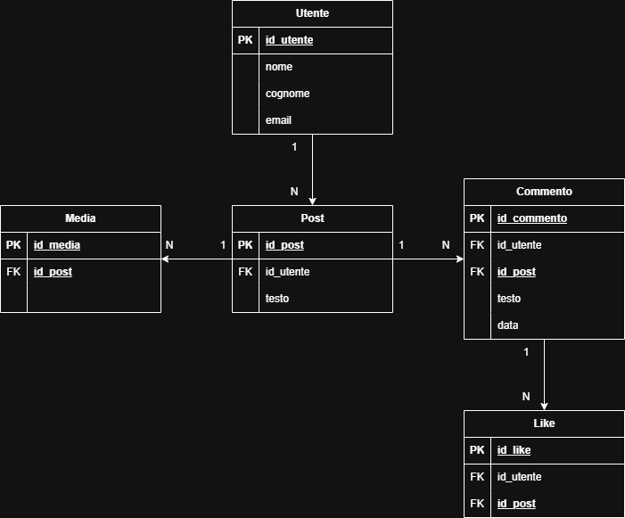

# 📚 DB Challenge

Benvenuto al DB Challenge!
L’obiettivo è progettare database relazionali a partire da casi reali, sviluppando:

analisi dei requisiti

modellazione E/R

esportazione dei diagrammi

spiegazione delle scelte progettuali

## 🧩 Cosa devi fare per ogni caso

Analizza il testo e individua entità, attributi e relazioni

Disegna il diagramma E/R con il tool che preferisci

Esporta il diagramma come immagine (PNG/SVG) e caricalo nella repo

Scrivi una breve spiegazione delle scelte progettuali

## 📂 Casi reali

### 1️⃣ Gestione Biblioteca

Entità principali:
Libri · Autori · Prestiti · Utenti · Categorie

📊 Diagramma E/R

Il sistema gestisce libri categorizzati in una o più Categorie, scritti da uno o più Autori.
Gli utenti possono prendere in prestito i libri tramite la tabella Prestito, che registra data di prestito, restituzione e stato del prestito.
La tabella ponte Libro_Autore gestisce la relazione molti-a-molti tra libri e autori.

### 2️⃣ Piattaforma di Food Delivery

Entità principali:
Ristoranti · Piatti · Ordini · Clienti · Consegne

📊 Diagramma E/R

 

Gli utenti (Clienti) effettuano Ordini che possono includere più Piatti tramite la tabella ponte Ordine_Piatto.
Ogni piatto appartiene a un Ristorante.
A ogni ordine è associata una Consegna con data e indirizzo di consegna.

### 3️⃣ Gestione Eventi

Entità principali:
Eventi · Partecipanti · Location · Biglietti · Sponsor

📊 Diagramma E/R

 

In questo sistema si gestiscono eventi svolti in una determinata Location.
Ogni evento può avere più Biglietti acquistati dai Partecipanti.
Gli eventi possono inoltre essere sponsorizzati da uno o più Sponsor, tramite una tabella ponte che registra l’importo e la data della sponsorizzazione.

### 4️⃣ Sistema di Gestione Cinema

Entità principali:
Film · Sale · Proiezioni · Spettatori · Prenotazioni

📊 Diagramma E/R

 

Il cinema gestisce Film programmati in una o più Proiezioni, ciascuna associata a una Sala.
Gli spettatori possono effettuare Prenotazioni per una proiezione, indicando il numero di posti.
Ogni prenotazione è legata a un singolo Spettatore.

### 5️⃣ Piattaforma Social

Entità principali:
Utenti · Post · Media · Commenti · Likes

📊 Diagramma E/R

 

Gli utenti possono pubblicare Post.
Ogni post può avere dei Media associati e può ricevere Commenti e Like.
Commenti e like sono sempre collegati sia al post sia all’utente che li ha creati.
